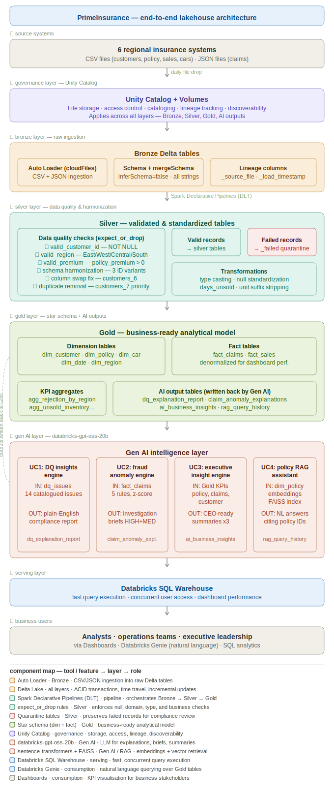

# PrimeInsurance — Data Intelligence Platform

**Team ASquare | Databricks Hackathon**

An end-to-end Data Intelligence Platform built on Databricks Lakehouse for a fictional auto insurance company. The platform ingests fragmented data from 7 regional systems, builds a clean analytical foundation using medallion architecture, and layers Gen AI capabilities on top — covering fraud detection, regulatory compliance, and executive reporting.

---

## The Problem

PrimeInsurance operates across multiple regional systems that were never standardized. The data arrives fragmented, inconsistent, and unreliable:

- Customer records spread across 7 independent files with different column names, swapped columns, typos, and 2,001 duplicate records
- 3,132 blank rows contaminating sales data; 164 genuinely unsold vehicles buried in the noise
- Claims with corrupted timestamps, string literals where nulls should be, and unknown values stored as `"?"`
- 1 policy record with a negative umbrella limit of -$1,000,000

The business consequences: regulatory exposure from unverified customer counts, a claims backlog from poor data quality, and revenue leakage from untracked inventory aging.

---

## Solution Architecture



The platform follows an 8-layer medallion architecture on Databricks Lakehouse:

| Layer | What it does |
|---|---|
| Source Systems | 6 regional insurance systems — CSV + JSON files |
| Unity Catalog | Governance, access control, lineage across all layers |
| Bronze | Raw ingestion via Auto Loader — all columns as strings, full lineage |
| Silver | Schema harmonization, DQ checks, quarantine for failed records |
| Gold | Star schema — 4 dims, 2 facts, 5 agg tables + AI output tables |
| Gen AI | 4 use cases: DQ insights, fraud detection, executive summaries, RAG assistant |
| SQL Warehouse | Fast, concurrent query serving for dashboards and Genie |
| Business Users | Analysts, operations, executives via dashboards and natural language |

---

## Repository Structure

```
DBx-Hackathon-TeamASquare/
│
├── README.md                              ← You are here
├── architecture_diagram.svg               # End-to-end architecture diagram
│
├── Data Engineering/
│   ├── primeinsurance-etl-ingestion-pipeline/
│   │   ├── bronze_pipeline.py             # Auto Loader ingestion — 5 Bronze DLT tables
│   │   └── README.md
│   │
│   ├── primeinsurance-etl-silver-pipeline/
│   │   ├── silver_pipeline.py             # Harmonization + DQ — 5 Silver + 5 quarantine tables
│   │   └── README.md
│   │
│   └── primeinsurance-gold-pipeline/
│       ├── gold_pipeline.py               # Star schema + aggs — 4 dims, 2 facts, 5 agg tables
│       └── README.md
│
├── gen-ai-implementation/
│   ├── designing_the_dQ_insight_ingine.py           # DQ registry + LLM explanations
│   ├── engineering_the_claims_risk_anomaly_engine.py # Fraud scoring + investigation briefs
│   ├── synthesizing_executive_business_insights.py  # KPI aggregation + executive summaries
│   ├── orchestrating_the_policy_intelligence_assistant.py  # RAG policy lookup
│   └── README.md
│
└── information_gathering/
    ├── information_gathering.py           # 28 SQL queries for raw data profiling
    ├── data_testing.py                    # Validation and integrity checks
    └── README.md
```

---

## Data Flow

### Source Data
12 raw source tables across 5 entities, ingested from Unity Catalog Volumes:

| Entity | Files | Format |
|---|---|---|
| Customers | `customers_1` to `customers_7` | CSV |
| Claims | `claims_1`, `claims_2` | JSON |
| Policy | `policy` | CSV |
| Sales | `sales_1`, `sales_2`, `sales_4` | CSV |
| Cars | `cars` | CSV |

### Bronze → Silver → Gold

| Layer | Tables | Purpose |
|---|---|---|
| Bronze | 5 | Raw ingestion — all columns as strings, full lineage |
| Silver | 5 clean + 5 quarantine | Schema harmonization, type casting, DQ enforcement |
| Gold | 4 dims + 2 facts + 5 aggs | Star schema for analytics and dashboards |

### Gen AI Output Tables

| Table | Schema | What It Contains |
|---|---|---|
| `dq_issues` | silver | 14 catalogued data quality issues with severity and fix |
| `dq_explanation_report` | gold | LLM-generated compliance explanations per DQ issue |
| `claim_anomaly_explanations` | gold | All 1,000 claims scored + investigation briefs for flagged ones |
| `ai_business_insights` | gold | Executive summaries for policy, claims, and customer domains |
| `rag_query_history` | gold | Natural language policy queries with retrieved docs and answers |

---

## Key Numbers

| Metric | Value |
|---|---|
| Raw customer records | 3,605 (across 7 files) |
| Unique customers after dedup | 1,604 |
| Clean policy records | 999 |
| Clean claims | 1,000 |
| Claims flagged for fraud investigation | ~300 (HIGH + MEDIUM) |
| Clean sales records | 1,849 |
| Unsold vehicles (revenue at risk) | 164 |
| Blank sales rows removed | 3,132 |
| DQ issues catalogued and explained | 14 |
| Vehicle catalogue records | 2,500 |

---

## Tech Stack

| Component | Technology |
|---|---|
| Platform | Databricks Lakehouse (Unity Catalog) |
| Ingestion | Auto Loader (`cloudFiles`) |
| Pipelines | Delta Live Tables (DLT) |
| Storage | Delta Lake — ACID, time travel |
| Processing | PySpark, Spark SQL |
| Orchestration | Databricks Workflows |
| LLM | `databricks-gpt-oss-20b` via Model Serving |
| Embeddings | `all-MiniLM-L6-v2` (sentence-transformers) |
| Vector Search | FAISS (`faiss-cpu`) |
| Cloud Storage | ADLS / S3 via Unity Catalog Volumes |

---

## Layer-by-Layer Detail

Each layer has its own README with full implementation details:

- **[Bronze README](Data%20Engineering/primeinsurance-etl-ingestion-pipeline/README.md)** — Auto Loader config, glob patterns, schema checkpoint locations, design decisions
- **[Silver README](Data%20Engineering/primeinsurance-etl-silver-pipeline/README.md)** — DQ rules per table, known source data issues, quarantine table structure, transformation logic
- **[Gold README](Data%20Engineering/primeinsurance-gold-pipeline/README.md)** — Star schema diagram, denormalization decisions, derived column reference, pre-agg table purpose
- **[Gen AI README](gen-ai-implementation/README.md)** — LLM integration pattern, fraud scoring rules, RAG pipeline steps, output table schema
- **[Exploration README](information_gathering/README.md)** — 28 query index, findings per entity, how findings shaped pipeline decisions
